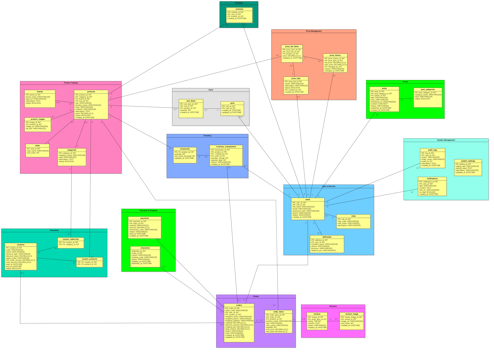

# ClothingStore – Quản lý cửa hàng quần áo
## Nhóm 8

## Kế hoạch và tiến độ từng tuần

| Tuần | Nội dung thực hiện | Người phụ trách | Kết quả cần đạt | Trạng thái |
|---|---|---|---|---|
| 1 | Phân tích yêu cầu, xác định chức năng và phân công công việc | Cả nhóm | Danh sách chức năng và bảng phân công công việc | Đã hoàn thành |
| 2 | Tìm hiểu và thực hành các thành phần đặc trưng trong Java | Cả nhóm | Hoàn thành các bài thực hành về các thành phần đặc trưng trong Java | Đã hoàn thành |
| 3 | Thực hành lập trình hướng đối tượng; thiết kế ERD cho dự án ClothingStore | Cả nhóm | Áp dụng lập trình hướng đối tượng; thiết kế ERD gồm 12 nhóm quản lý và 30 bảng | Đã hoàn thành |
| 4 | Xây dựng RESTful API với Spring Boot | Cả nhóm | Các API phục vụ chức năng của dự án | Đang hoàn thành |

## Sơ đồ ERD – Tuần 3

Nhóm 8 thiết kế cơ sở dữ liệu cho dự án ClothingStore gồm **12 nhóm quản lý và 30 bảng**.

